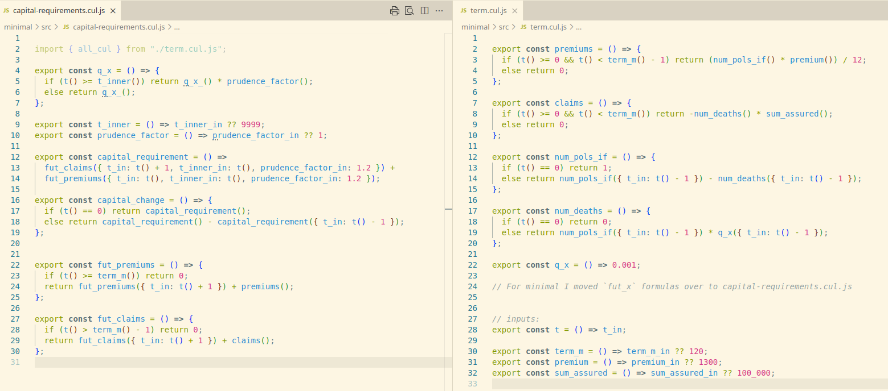

# nested-life-projections-example

This [calculang](https://calculang.dev) example is based on [nested.py](https://github.com/actuarialopensource/methodology/blob/main/nested/nested.py), a "minimum reproduceable nested model" by Lewis Fodgen. It ties back exactly, but implementations are different.

## `nested.py`, using Class Inheritance and Dynamic Inner Projections

`nested.py` implements a `Term` base class and `PrudentTerm` and `RealisticTerm` subclasses: extending `Term` modelling logic with prudent assumptions and capital requirement calculations respectively.

*At each time point* `RealisticTerm` initialises and runs an inner projection of it's sibling class `PrudentTerm` to estimate prudent capital requirements.

## calculang: `capital-requirements.cul.js`

Similar to the `Term` base class, the calculang model centralises common modelling logic in `term.cul.js`.

`capital-requirements.cul.js` is a calculang model that imports `term.cul.js`, but "overriding" specific behavior for capital requirement calculations.

Notably, the `q_x` formula is overriden to apply a prudence factor or not depending on new projection inputs. Then, `capital_requirements` formula definition can call appropriate cashflow projection formulas (specifically `fut_claims`), applying appropriate new projection input values relating to prudence.

Input inference

Although the `q_x` formula is explicitly overridden to use new inputs and the logic in `term.cul.js` has no notion about them, the calculang **compiler** infers that `num_deaths` all the way to `fut_claims` in `term.cul.js` should use the new inputs. Input inference explains why there is a lot of empty/minimalistic brackets in calculang functions and calls (which I might remove in future), and this promotes very general definition of modelling logic, so that can be applied for many different purposes.

Input inference helps formulas to be concise, but adaptability is the real goal.

## How to Run/Analyse This Model

## Option 1: Annotated calculang Model using Actuarial Playground UI

[**Use this link** to run in the Actuarial Playground UI](https://actuarialplayground.com/#url=https://raw.githubusercontent.com/calculang/nested-life-projections-example/refs/heads/main/src/capital-requirements.cul.js) OR:

To see results using the Actuarial Playground UI:

1. Copy to clipboard:

~~~js
import { all_cul } from 'https://raw.githubusercontent.com/calculang/nested-life-projections-example/refs/heads/main/src/capital-requirements.cul.js'
~~~

2. Open [ActuarialPlayground.com](https://actuarialplayground.com)

3. Click '💬' to show model formulas

4. Select all code, delete, replace with the clipboard

5. The visualization will update, and you can browse all the formula code by looking in the dropdown

**Tip**: Use the mouse wheel to zoom in and out of the Playground visualization, and hold shift to zoom on the y axis only (to control the aspect ratio).

**Tip** 📌: there is a semi-transparent '🥚' in the Actuarial Playground UI; there you can turn on graphs and an improved (more responsive) tooltip over visualization elements, as well as a legend.

**Note**: Especially when model code is loaded from a URL (by following the instructions above), there are some bugs around *editing* directly in the Actuarial Playground UI: especially when you switch `.cul.js` files, you probably lose custom changes.

*If you don't like using the Playground UI, feel free to create an issue or PR for a node.js script or other that runs this calculang model and outputs values in a table*

## Option 2: Minimal calculang Model

[`./minimal`](./minimal/) achieves the same results but without comments or redundant formulas: for analysis of the calculang logic/implementation itself.

[Load in the Actuarial Playground](https://actuarialplayground.com/#url=https://raw.githubusercontent.com/calculang/nested-life-projections-example/refs/heads/main/minimal/src/playground.cul.js).

---

**Feedback/Discussion/Help Wanted**: I'm really interested in early reactions about the calculang approach to this. I aim to provide more helpful material for actuaries about how I apply these patterns, and early reactions will help to ground that work. Nested actuarial modelling approaches are open for discussion with the Actuarial Open Source Community [here](https://github.com/actuarialopensource/methodology/discussions) and a specific discussion about this implementation is [here](#)

This month I'm also happy to meet and discuss with members of the [Actuarial Open Source Community](https://www.linkedin.com/groups/13937070) who have notable experience applying Python, Julia, R for actuarial modelling in practice.

**More Information**: The '❓' tab in [ActuarialPlayground.com](https://actuarialplayground.com) mentions other instances where I apply other patterns using the same functionality in calculang. The [calculang README](https://github.com/calculang/calculang) has separate wording for some of the calculang features applied here. A buggy UI that surfaces exactly what the calculang compiler outputs is [here](https://finding-calculang-foc.netlify.app/editor) (FIXING).
