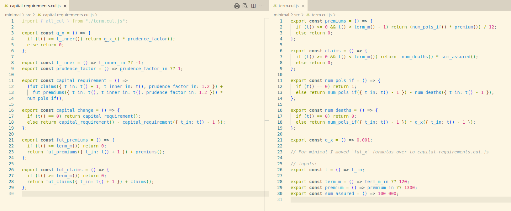

# nested-life-projections-example

This [calculang](https://calculang.dev) example is based on [nested.py](https://github.com/actuarialopensource/methodology/blob/main/nested/nested.py), a "minimum reproduceable nested model" by Lewis Fodgen. It ties back exactly, but implementations are different.

It's an example using [modularity, input inference and overriding](https://github.com/calculang/calculang?tab=readme-ov-file#design-principlesfeatures): key technical features in calculang that permit flexibility and reusability in models ♻️

## nested.py, using Class Inheritance and Dynamic Inner Projections

nested.py implements a `Term` base class and `PrudentTerm` and `RealisticTerm` subclasses: extending `Term` modelling logic with prudent assumptions and capital requirement calculations respectively.

*At each time point* `RealisticTerm` initialises and runs an inner projection of it's sibling class `PrudentTerm` to estimate prudent capital requirements.

## calculang model: capital-requirements.cul.js

Similar to with the `Term` base class, the calculang model centralises common modelling logic in `term.cul.js` (itself a simple calculang model).

[`capital-requirements.cul.js`](./src/capital-requirements.cul.js) is a calculang model that imports the [`term.cul.js`](./src/term.cul.js) model, but "overriding" specific behavior for capital requirement calculations.

Notably, the `q_x` formula is overriden to apply a prudence factor or not depending on new projection inputs. Then, `capital_requirements` formula definition can call appropriate cashflow projection formulas, applying appropriate new projection input values relating to prudence.

🤔 Related formula definitions

[`capital-requirements.cul.js`](./src/capital-requirements.cul.js)

~~~js
export const q_x = () => {
  if (t() >= t_inner()) return q_x_() * prudence_factor();
  else return q_x_();
};

export const capital_requirement = () =>
  fut_claims({ t_in: t() + 1, t_inner_in: t(), prudence_factor_in: 1.2 }) +
  fut_premiums({ t_in: t(), t_inner_in: t(), prudence_factor_in: 1.2 });
~~~

Input inference & multipurpose models ♻️

Although the `q_x` formula is explicitly overridden to use new inputs and the logic in `term.cul.js` has no notion about them, the calculang **compiler** infers that `num_deaths` all the way to `fut_claims` in `term.cul.js` should use the new inputs.

Input inference explains why there is a lot of empty/minimalistic brackets in calculang functions and calls (which I might remove in future). Input inference promotes very general specification of modelling logic, so that modelling logic can be shared across lots of different modelling exercises.

Input inference clearly helps formulas to be more concise, but flexibility and reusability is it's real purpose.

calculang aims to make models that are multipurpose in the extreme, and where this follows naturally from the language design.

## How to Run/Analyse This Model

## Option 1: Annotated calculang Model using Actuarial Playground UI

[**Use this link** to run in the Actuarial Playground UI](https://actuarialplayground.com/#url=https://raw.githubusercontent.com/calculang/nested-life-projections-example/refs/heads/main/src/capital-requirements.cul.js) **Click '💬' to show model formulas and use dropdown to select .cul.js files** OR else:

1. Copy to clipboard:

~~~js
import { all_cul } from 'https://raw.githubusercontent.com/calculang/nested-life-projections-example/refs/heads/main/src/capital-requirements.cul.js'
~~~

2. Open [ActuarialPlayground.com](https://actuarialplayground.com)

3. Click '💬' to show model formulas

4. Select all code, delete, replace with the clipboard

5. The visualization will update, and you can browse all the formula code by looking in the dropdown

**Tip**: Use the mouse wheel to zoom in and out of the Playground visualization, and hold shift to zoom on the y axis only (to control the aspect ratio).

**Tip** 📌: there is a semi-transparent '🥚' in the Actuarial Playground UI; there you can turn on graphs and an improved (more responsive) tooltip over visualization elements, as well as a legend.

**Note**: Especially when model code is loaded from a URL (by following the instructions above; either approach), there are some bugs around *editing* directly in the Actuarial Playground UI: especially when you switch `.cul.js` files, you probably lose custom changes.

*If you prefer usage in a node.js script or other, please create an issue to request it or a PR*

## Option 2: Minimal calculang Model

[`./minimal`](./minimal/) achieves the same results but without comments or redundant formulas: for analysis of the calculang logic/implementation itself.

[Load in the Actuarial Playground](https://actuarialplayground.com/#url=https://raw.githubusercontent.com/calculang/nested-life-projections-example/refs/heads/main/minimal/src/playground.cul.js). **Click '💬' to show model formulas and use dropdown to select .cul.js files**

---

**Feedback/Discussion**: I'm really interested in early reactions about the calculang patterns to this problem. I aim to provide more helpful material for actuaries about how I apply the specific calculang features, and early reactions will help to ground that work.

Nested actuarial modelling approaches are open for discussion with the Actuarial Open Source Community [here](https://github.com/actuarialopensource/methodology/discussions) and a specific discussion about this implementation is posted [here](#). Please participate there!

This month I'm also happy to meet and discuss with members of the [Actuarial Open Source Community](https://www.linkedin.com/groups/13937070) who have notable experience applying Python, Julia, R for actuarial modelling in practice. Specifically interested to discuss extensibility of actuarial models in practice.

**More Information**: The '❓' tab in [ActuarialPlayground.com](https://actuarialplayground.com) mentions other instances where I apply the same functionality in calculang. The [calculang README](https://github.com/calculang/calculang) has separate wording for some of the calculang features applied here. A buggy UI that surfaces exactly what the calculang compiler outputs is [here](https://finding-calculang-foc.netlify.app/editor) (FIXING).
