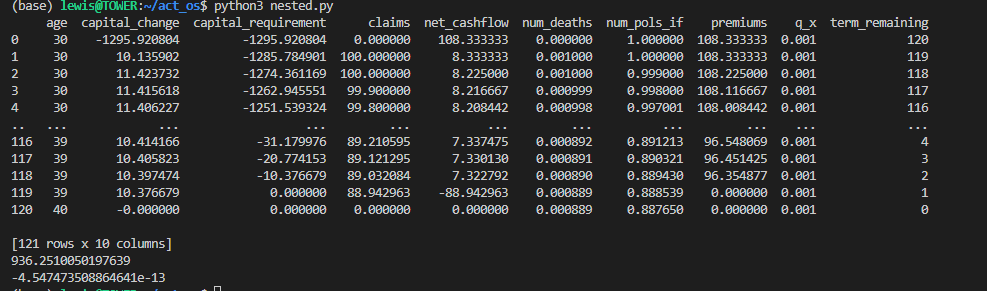
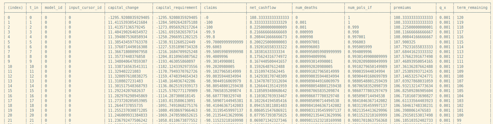

Showing some output from the calculang compiler.

- `make-bundle.js` is the node.js script that creates outputs:
- `bundle.js` is the final Javascript output of the model, which can be used in a browser or other Javascript runtimes (including node.js)
- other .js files are the Javascript corresponding to each processed module. It may be informative to compare these to their corresponding `.cul.js` files, which highlights how the compiler manipulates calculang code into functioning Javascript.

Not shown: sourcemaps or introspection object.

---

Also includes `run.js` to compile and run the model. Use `npm run model-output` or run `node run.js` to produce the table in `output.txt` which matches nested.py:

### nested.py output

### output.txt

`run.js` uses `calcudata`, a convenience API for querying many results from calculang or Javascript models.
